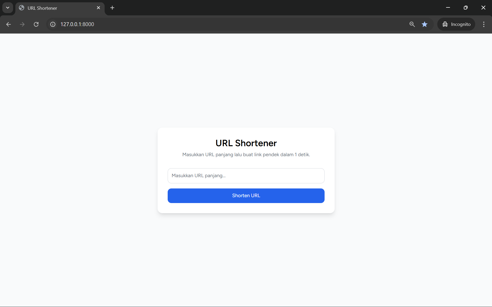

# 🔗 URL Shortener – Laravel + React (Inertia.js)

Aplikasi sederhana untuk mempersingkat URL panjang menjadi link pendek.  
Dibangun menggunakan **Laravel 12**, **React**, **TailwindCSS**, dan **Inertia.js**.

---

## Tampilan Project

### Home Page



---

## 🚀 Features

-   Memperpendek URL secara otomatis
-   Validasi URL (required, url, active_url)
-   Redirect ke original URL menggunakan short code
-   UI modern dengan React + Tailwind
-   Copy to clipboard
-   Loading state pada tombol
-   Error handling dari backend ke frontend

---

## 🛠 Tech Stack

**Backend:**

-   Laravel 12
-   MySQL
-   Eloquent ORM

**Frontend:**

-   React (Inertia.js)
-   TailwindCSS
-   Axios

---

## 📦 Installation

1. Clone Repository

```bash
git clone https://github.com/Luqman89/url-shortener.git
cd url-shortene
```

2. Install Dependencies

```bash
composer install
npm install
```

3. Copy .env

```bash
cp .env.example .env
```

4. Generate App Key

```bash
php artisan key:generate
```

5. Migrate Database

```bash
php artisan migrate

```

6. Run Development Server

```bash
php artisan serve
npm run dev
```

License
MIT
